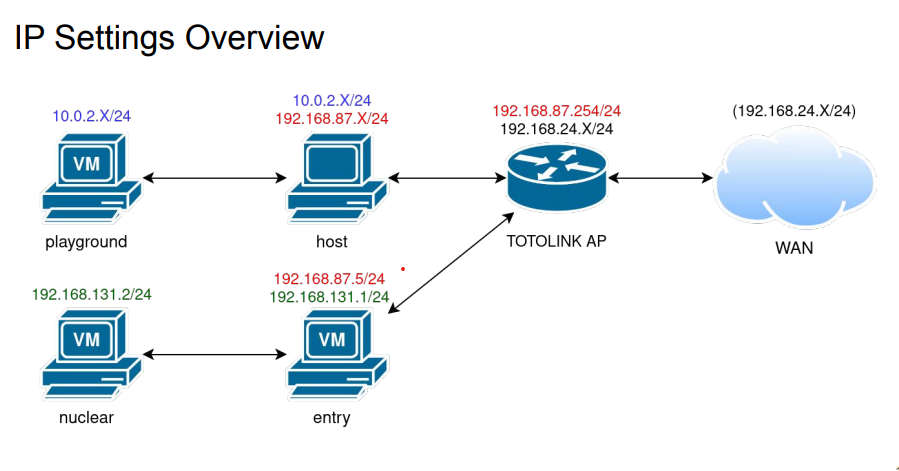
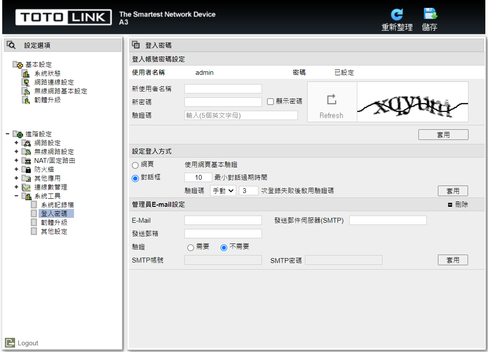
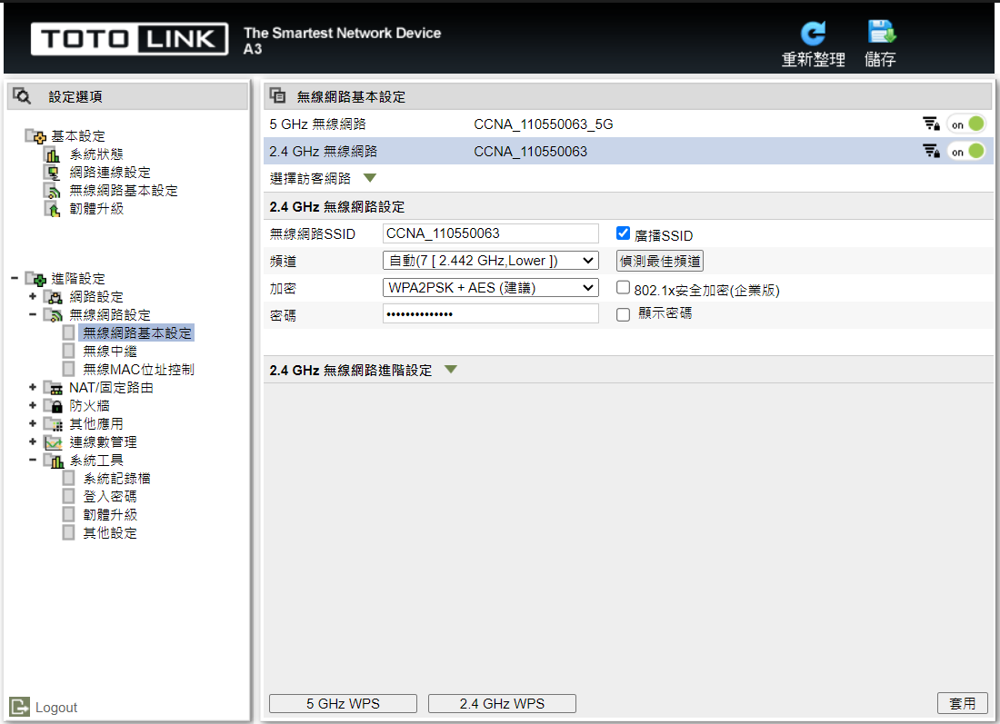
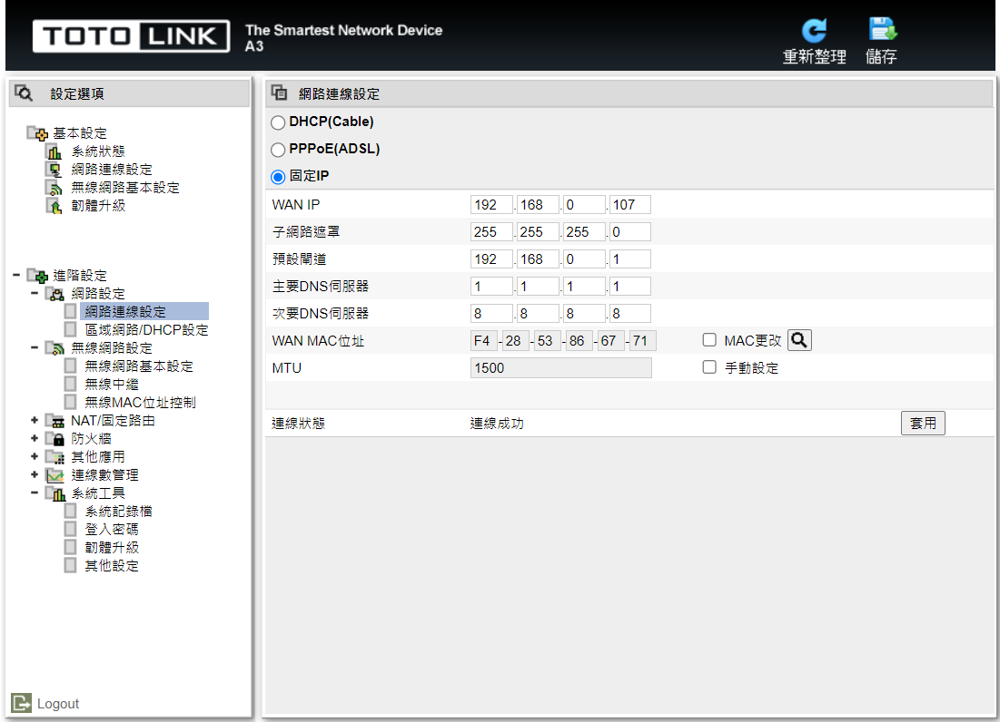
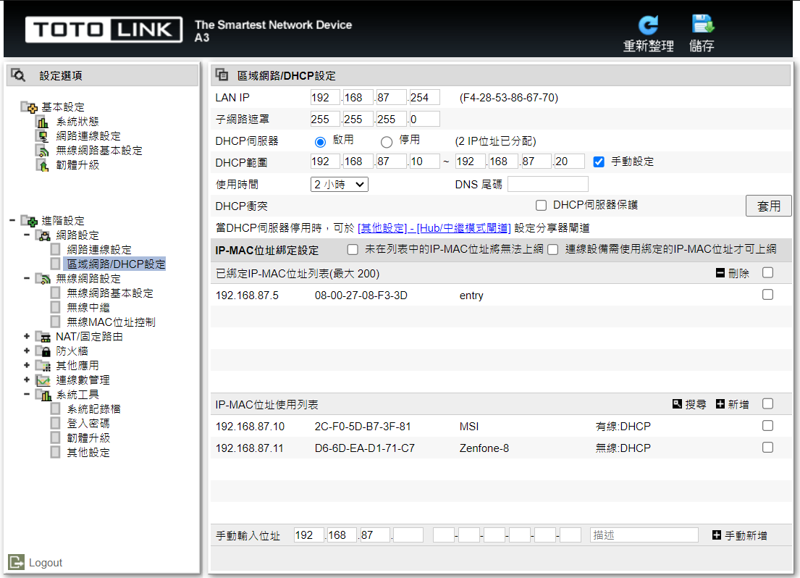
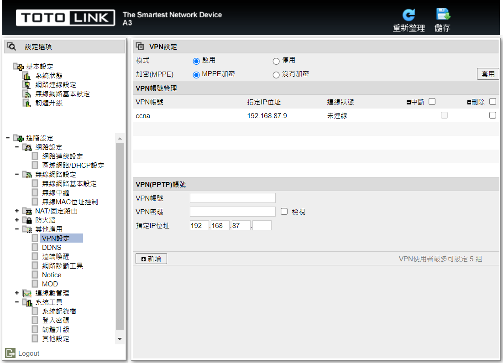
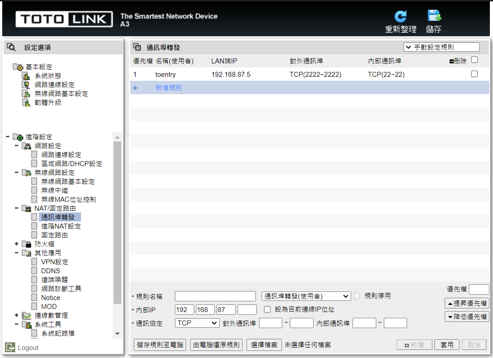
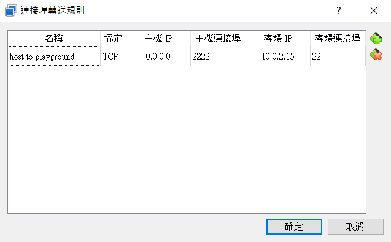
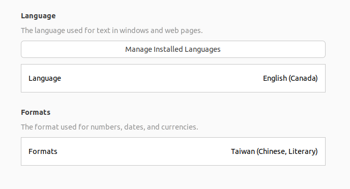

# Project 1 VM Networking

## Table of Contents

- [Project 1 VM Networking](#project-1-vm-networking)
  - [Table of Contents](#table-of-contents)
  - [Topology](#topology)
  - [Spec](#spec)
    - [Basic](#basic)
    - [WAN](#wan)
    - [AP](#ap)
    - [Host](#host)
    - [VM(entry)](#vmentry)
    - [VM(playground)](#vmplayground)
    - [VM(nuclear)](#vmnuclear)
  - [Requirement](#requirement)
    - [WAN Connectivity](#wan-connectivity)
    - [SSH](#ssh)
  - [Possible Problems](#possible-problems)

## Topology



## Spec

### Basic

- Hard reset the AP
  - Follow the manual
- Download UNIX-like OS VMs
  - Ubuntu Desktop 22.04 LTS
- For every VM
  - Username / Password: ccna / ccna
  - SSH server should be started & enabled

    ```shell
    sudo apt update
    sudo apt install ssh
    ```

### WAN

- Anyone outside the subnet of the AP

### AP

- Change the admin password to my student ID
  
- Change SSID to “CCNA_\<my student ID>” and WPA2 password for Wi-Fi
  
- WAN: Static, 192.168.24.x/24 (only use on demo)
  
- LAN IP Address: 192.168.87.254/24
  
- PPTP VPN Server
  - Encryption: MPPE
  - Username / Password: ccna / \<my student ID>
    

### Host

- IP Address: DHCP, between 192.168.87.10/24 ~ 192.168.87.20/24
  - Set in AP
- Assume ssh server is not enabled

### VM(entry)

- Hostname: entry
- Interface 1
  - Network adapter attached to "Bridged Adapter"
  - DHCP, reserved to 192.168.87.5/24
    - Set in AP, bind IP to MAC
- Interface 2
  - Network adapter attached to "Internal Network" and set name to ‘internal’
  - Set the ip 192.168.131.2/24 to internal network

    ```shell
    sudo ip addr add dev enp0s8 192.168.131.1/24
    ```

### VM(playground)

- Hostname: playground
- Interface 1
  - Network adapter attached to "NAT"
  - Use the default IP

### VM(nuclear)

- Hostname: nuclear
- Interface 1
  - Network adapter attached to "Internal Network" and set name to ‘internal’
  - Set the ip 192.168.131.2/24 to internal network

    ```shell
    sudo ip addr add dev enp0s8 192.168.131.2/24
    ```

## Requirement

### WAN Connectivity

- host to WAN
  - Ping 1.1.1.1
  
    ```shell
    ping 1.1.1.1
    ```

- entry to WAN
  - Ping 1.1.1.1
  
    ```shell
    ping 1.1.1.1
    ```

- playground to WAN
  - Ping 1.1.1.1
  
    ```shell
    ping 1.1.1.1
    ```

- nuclear to WAN (bonus)
  - Set IP forwarding on entry
    - Uncomment or add net.ipv4.ip_forward = 1 in /etc/sysctl.conf
  
      ```shell
      sudo vi /etc/sysctl.conf
      ```

      ```shell
      net.ipv4.ip_forward = 1
      ```

      ```shell
      sudo iptables -t nat -A POSTROUTING -s 192.168.131.0/24 -j MASQUERADE
      ```

  - Add default gateway to nuclear
  
    ```shell
    sudo ip route add default via 192.168.131.2
    ```

  - ping 1.1.1.1
  
    ```shell
    ping 1.1.1.1
    ```

### SSH

- WAN to entry
  - Set port forwarding on AP
  
  
  ```shell
  ssh 192.168.24.x -p 2222 -l ccna
  ```

- host to playground
  - Set port forwarding on playground
  

  ```shell
  ssh localhost -p 2222 -l ccna
  ```

- host to nuclear
  - By proxy jump
  
  ```shell
  ssh 192.168.131.2 -l ccna -J ccna@192.168.87.5
  ```

- WAN to playground
  - Set VPN on AP and WAN
    - See Appendix B
  - By proxy jump
  
  ```shell
  ssh 192.168.87.10 -p 2222 -l ccna
  ```

- WAN to nuclear (bonus)
  - By proxy jump (when VPN is on)
  
  ```shell
  ssh 192.168.131.2 -l ccna -j ccna@192.168.87.5
  ```

## Possible Problems

- User is not in sudoers file
  - Add User in sudoers file
  
    ```shell
    sudo vi /etc/sudoers
    ```

    ```shell
    # User privilege specification
    root ALL=(ALL:ALL) ALL
    User ALL=(ALL:ALL) ALL
    ```

- Terminal can not open
  - Change the language into English(Canada) and restart
  
