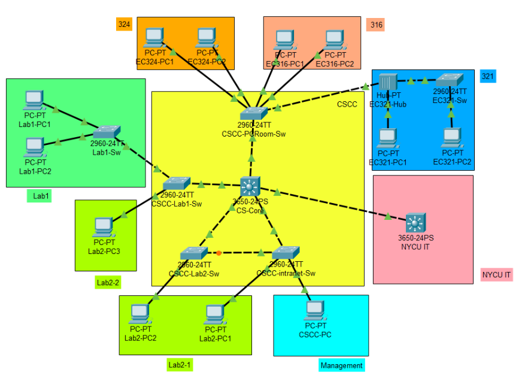
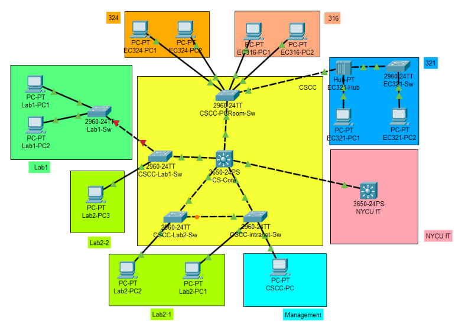

# Project 2 L2 Network Setting

## Table of Contents

- [Project 2 L2 Network Setting](#project-2-l2-network-setting)
  - [Table of Contents](#table-of-contents)
  - [情境](#情境)
  - [注意事項](#注意事項)
  - [本次作業你需要修改的範圍](#本次作業你需要修改的範圍)
  - [Switch 基本設定](#switch-基本設定)
  - [VLAN](#vlan)
  - [Switch IP Address \& Gateway](#switch-ip-address--gateway)
    - [連通性](#連通性)
  - [STP](#stp)
    - [連通性(STP)](#連通性stp)
  - [CS-Core](#cs-core)
    - [連通性(CS-Core)](#連通性cs-core)
  - [Tips](#tips)
  - [作業繳交](#作業繳交)

## 情境

上圖為假想工三網路架構，你現在是系計中 Net 組助教，要對工三網路進行設定，你有兩間電腦教室，三間實驗室 (Lab) ，其中兩間為同一位教授實驗室，而上行為校計中，你需要對系計中掌管的 6 台 Switch 進行設定，另外為了可以遠端設定所有 Switch ，你要設置一台 Management PC 行 Switch 管理，以下為詳細設定資訊。

| Device      | IP Address        | Gateway        |
| :---------- | :---------------- | :------------- |
| Lab1-PC1    | 140.113.20.2/27   | 140.113.20.1   |
| Lab1-PC2    | 140.113.20.3/27   | 140.113.20.1   |
| Lab2-PC1    | 140.113.20.34/27  | 140.113.20.33  |
| Lab2-PC2    | 140.113.20.35/27  | 140.113.20.33  |
| Lab2-PC3    | 140.113.20.36/27  | 140.113.20.33  |
| EC316-PC{X} | 140.113.16.X/24   | 140.113.16.254 |
| EC324-PC{X} | 140.113.24.X/24   | 140.113.24.254 |
| EC321-PC{X} | 140.113.21.X/24   | 140.113.21.254 |
| CSCC-PC     | 140.113.10.100/24 | 140.113.10.254 |
| NYCU IT     | 140.113.1.1/30    | -              |

## 注意事項

- 寫作業的過程中建議定時存檔，以免 Packet Tracer 突然 crash
  - 特別是在 Simulation 模式下如果紀錄太多封包可能會因為記憶體用量過大而 crash，請多加注意
  - 定時存檔包括保存 pka 以及 switch 的設定
- 在 Packet Tracer 底下測試網路時，時常有「前幾次測試沒通，後來就通了」的情況
  - 可以嘗試多戳幾次以及讓時間加速一點，避免被 Packet Tracer 雷
- 請勿增加任何**不必要的設定**以免影響自動評分腳本

## 本次作業你需要修改的範圍

- 包括：
  - CSCC
  - Management
  - 321
- 不包括：
  - NYCU IT
  - 324
  - 316
  - Lab 1
  - Lab 2

## Switch 基本設定

- 每台 switch 皆需要
- 將 Hostname 設爲標籤上的名稱
- 增加本地帳號 (local account)
  - 帳號: `ccna`
  - 密碼: `ccna`
  - 以 **md5** 形式存在 configuration 裏
  - CS-Core console 操作需登入本地帳號
- 設定 enable 密碼
  - 密碼: `project2`
  - 以 **md5** 形式存在 configuration 裏
- 設定 ssh
  - 使用 `cs.nycu.edu.tw` 爲 domain name
  - modulus length 設為 `2048`
  - version 設為 `2`
  - 僅能使用 ssh 登入，關閉 telnet 登入 **（套用到所有 vtys）**
- 關閉所有沒有在使用的 interface（沒有接線的 interface）
- Switch 不允許向終端 (edge) 發送 CDP
  - CSCC 內的 Switch 除了往上行 NYCU IT 走之外都算終端設備 (edge)
  - **請勿將不發送設為預設，僅將某些下行介面關閉就好。**

## VLAN

- 命名為 `VLAN{number}`
- Lab1 使用 `VLAN101`
- Lab2-1 & Lab2-2 使用 `VLAN102`
- Management 使用 `VLAN30`
- 324 使用 `VLAN324`
- 316 使用 `VLAN316`
- 321 使用 `VLAN321`
  - 請注意他的前面有一台 Hub
- **系計中內的 switch 之間的線路都是 trunk mode**
  - **其他的線路都是 access mode**
- 對於每一條 trunk 只允許**必要的** VLAN
- 如果有調整 Native VLAN 的需求，請做**最小程度**的調整，其餘維持預設 (VLAN 1)

## Switch IP Address & Gateway

| Device        | IP Address       | Gateway        |
| :------------ | :--------------- | :------------- |
| CSCC-PCRoom   | 140.113.10.10/24 | 140.113.10.254 |
| CSCC-intranet | 140.113.10.11/24 | 140.113.10.254 |
| CSCC-Lab1     | 140.113.10.12/24 | 140.113.10.254 |
| CSCC-Lab2     | 140.113.10.13/24 | 140.113.10.254 |
| EC321-Sw      | 140.113.10.14/24 | 140.113.10.254 |

- Switch IP 請設置於 VLAN30
- CS-Core 會擔任每一個 VLAN 的 gateway：
  - VLAN 30: 140.113.10.254/24
  - VLAN 101: 140.113.20.1/27
  - VLAN 102: 140.113.20.33/27
  - VLAN 324: 140.113.24.254/24
  - VLAN 316: 140.113.16.254/24
  - VLAN 321: 140.113.21.254/24

### 連通性

- 至此的設定應該使相同 LAN 機器 (PC & Switch) 可以互相 ping 通，而不同 LAN 則不行 (CS-Core routing 尚未啟用)
- 確保 CS-Core、CSCC-Lab2、CSCC-intranet 之間任何一條 link 斷線都不會影響連通性

## STP

- 對於每臺 Switch STP Mode 設定爲 `rapid-pvst`
- Switch 終端 (edge) 連線 Port 設定直接進到 Forwarding，使連線快速啟用，並防止 BPDU 封包進入這些界面，當偵測到，則 **Error Disable 掉該介面**
  - CSCC 內的 Switch 除了往上行 NYCU IT 走之外都算終端設備 (edge)
  - 不要將設定設爲 default
  - 注意，CSCC & 321 之間也需要，但也要確保該線路通暢
- 固定 CS-Core 爲所有 VLAN 的 spanning tree instance 的 root
  - 設爲 root primary
  - 包括 `VLAN 1,30,101,102,316,321,324`

### 連通性(STP)

- 可能會使部分連線 Error Disable

## CS-Core

- 啟用 Routing
- 設定 default route 將流量丟往 140.113.1.1
- 上行介面（Gig1/0/24）
  - L3 interface
  - IP: 140.113.1.2/30
  - Gateway: 140.113.1.1
  - 要發送與接收 LLDP 封包

### 連通性(CS-Core)

- 除因 STP 部分 Error Disable 連線外，若暫時取消 STP 特定設定，則所有機器 (PC & Switch) 彼此應該都能 ping 通（包括 ping 到 NYCU-IT）

## Tips

- 可以透過 PC 的 Desktop 來進行測試
- pka 內附的 `Test` scenario 除了 `Lab1-PC1 -> NYCU IT` 會 `Failed` 之外，其他都應該是 `Successful`
- pka 的 PT Activity（一開始跳出來的小視窗）提供的 `completion` 僅供參考，不到 100% 是正常的
- 如果不知道網路線對的是哪個 port 的話，以下提供幾個方法
  - 在 Options -> Preferences 把 Always show port label 打開
  - 把滑鼠指到裝置上面，可以看到 interfaces 的資訊
  - 進到設備裡面看 `show int` 或 `show run`，並搭配你的知識來猜
  - 使用 CDP

以下是預期的拓樸

## 作業繳交

- 如果有任何對 Spec 有不清楚的地方需要請助教解釋或是需要助教幫忙，請以下方式擇一：
  - TA Time 時候來系計中 (EC320)
  - 寄信到 <npta@cs.nctu.edu.tw>
- **如果你寄信到助教的私人信箱或 E3 信箱，那麼有可能會被忽略！**
- 將 pka 檔上傳至 E3 作業繳交區（檔名請命名為 `HW2_<學號>.pka`）
  - ex. `HW2_0612213.pka`
- **請確定你有保存 switch 的 config，demo 時我們將重開 switch**
- Deadline: 2024/04/11 23:59
  - 允許在 Demo 前補交，分數將打九折
- Demo: 2024/04/12
  - Demo 時將會問一些問題 (算分)
  - Schedule 將在之後公布
