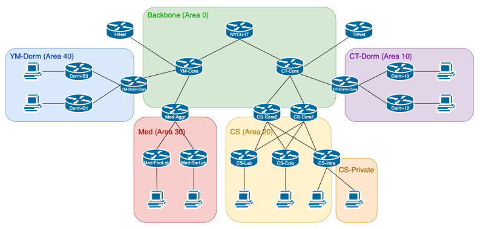

# Project 3 OSPF

## Table of Contents

- [Project 3 OSPF](#project-3-ospf)
  - [Table of Contents](#table-of-contents)
  - [Overview](#overview)
  - [1. Advertise Networks](#1-advertise-networks)
  - [2. Private Network](#2-private-network)
  - [3. Passive Interface](#3-passive-interface)
  - [4. Intergate with RIP](#4-intergate-with-rip)
  - [5. Stub Area](#5-stub-area)
  - [6. Cost](#6-cost)
  - [7. Debug YM-Dorm](#7-debug-ym-dorm)
  - [8. Debug Med](#8-debug-med)
  - [Appendix A. Router ID](#appendix-a-router-id)
  - [Appendix B. Peering IP Address](#appendix-b-peering-ip-address)
  - [Notice](#notice)

## Overview

- 開始前，請先翻過整份 spec，包含最後注意事項
- 繳交截止時間：5/23（四）
  - Demo 前補交者，pka 成績打八折

## 1. Advertise Networks

在熟悉網路拓樸後，將適當的網段加入 OSPF

附錄有 `10.0.0.0/8` 的網段規劃，`140.113.0.0/16` 的網段請自行列舉

❗ 注意：使用設定在 interface 的方式不予計分，在 Demo 時如果能詳細解釋差異，可由助教酌情加分

## 2. Private Network

有一區 `CS-Private` 網段（`140.113.28.0/24`）
只能允許資工系 `140.113.26.0/24` 連線，外系、外校無法存取

也請確保這個網段可以正常存取資工系 `140.113.26.0/24` 上的服務

❗ 注意：請用 Routing 技巧完成，使用 ACL、NAT 不算分

## 3. Passive Interface

在交大的宿舍路由器，禁止終端使用者參與 OSPF 相關活動

❗ 注意：請使用 5 行以內的設定檔完成此要求

## 4. Intergate with RIP

在陽明醫學系的網路中，有非 OSPF 的網路協定

請用最適當的方式，讓兩邊的資訊能互通

對於「Metric Types for Type 5 LSA」請選擇最適當的類型

## 5. Stub Area

為了節省陽明校區內路由器的負擔，請設定適當的 Stub 種類

在維持網路運作正常的前提下，最大程度減少所收到的資訊

## 6. Cost

請透過 cost 設定，讓網路流量（包含上傳下載）符合以下列表

- CS-Intra <–> CS-Core1
- CS-Colo <–> CS-Core1
- CS-Lab <–> CS-Core2

只需要處理跨 Area 的流量，同屬 Area 20 的流量經過任一台 Core 都可以

❗ 注意：這項需求無法自動評測，會在 Demo 時檢查，需要能解釋原理

## 7. Debug YM-Dorm

請找出為何 YM-Dorm (Area 40) 的 OSPF 功能無法正常運作

用總共 5 條以內的設定檔修復，並記錄下理由

❗ 注意：於 Demo 時需要回答發現什麼問題、問題成因、如何修復

## 8. Debug Med

請找出為何 Med (Area 30) 的 OSPF 功能無法正常運作

用總共 5 條以內的設定檔修復，並記錄下理由

❗ 注意：於 Demo 時需要回答發現什麼問題、問題成因、如何修復

## Appendix A. Router ID

格式：`140.113.0.x`

`NYCU-IT` - 1
`CT-Core` - 2
`YM-Core` - 3

`CT-Dorm-Core` - 11
`Dorm-10` - 12
`Dorm-12` - 13

`CS-Core1` - 21
`CS-Core2` - 22
`CS-Lab` - 23
`CS-Colo` - 24
`CS-Intra` - 25

`Med-Core` - 31
`Med-FooLab` - 32
`Med-BarLab` - 33

`YM-Dorm-Core` - 41
`Dorm-B3` - 42
`Dorm-G1` - 43

## Appendix B. Peering IP Address

IT - CT 10.0.1.x
IT - YM 10.0.2.x
CT - TANet 10.0.10.x
CT - Dorm 10.0.11.x
CT - Core1 10.0.12.x
CT - Core2 10.0.13.x
YM - HiNet 10.0.20.x
YM - Dorm 10.0.21.x
YM - Med 10.0.22.x

Dorm - 10 10.1.1.x
Dorm - 12 10.1.2.x

Core1 - Lab 10.2.11.x
Core1 - Colo 10.2.12.x
Core1 - Intra 10.2.13.x
Core2 - Lab 10.2.21.x
Core2 - Colo 10.2.22.x
Core2 - Intra 10.2.23.x

Med - Foo 10.3.1.x
Med - Bar 10.3.2.x

Dorm - B3 10.4.1.x
Dorm - G1 10.4.2.x

（`140.113.0.0/16` 網段請自行探索）

## Notice

- 本次作業共八項需求，pka 成績合計 100%
- Project 3 成績 = pka 成績 \* 80% + Demo 成績 \* 20%
  - 如未 Demo 則 Project 3 成績以零分計算
- User Profile 的名字請填入學號
- 完成後請繳交到 E3，檔名請用 `學號.pka`
- 請隨時記得存檔，Packet Tracer 很容易突然 crash
- 已知 bug：模擬器中的 3650 (Layer 3 Switch) 不支援 interface description
- 建議每隔一段時間，手動複製一份 pka 備份，以便出事時保存進度
- LSA 預設要過 60 分鐘才會失效，請善用左下角加速鍵